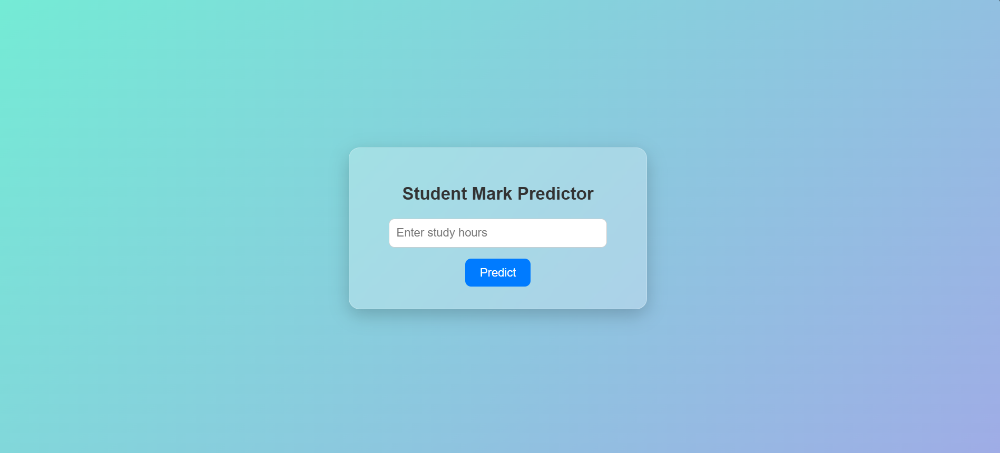
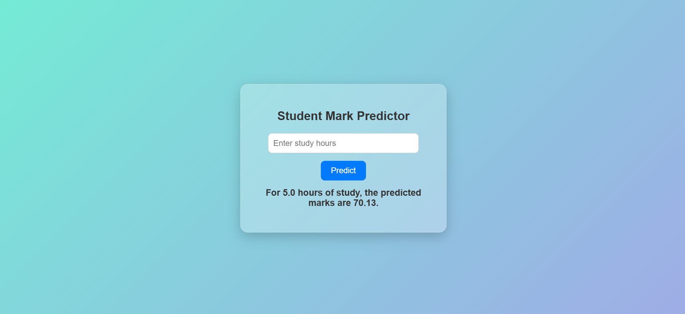
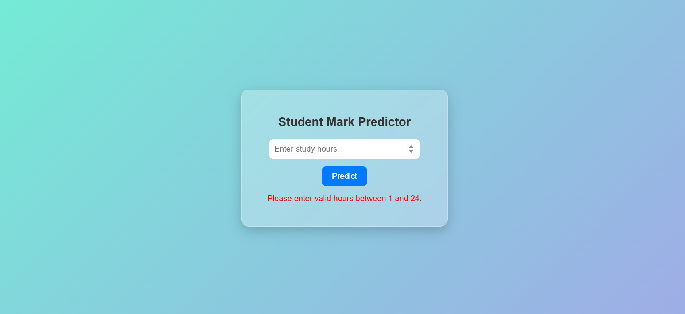

# Student Mark Predictor

A simple yet elegant web application built with **Flask** and **Linear Regression** that predicts student marks based on study hours.  

This project demonstrates the complete workflow of:  
- Building a machine learning model in Python  
- Saving it with **Joblib**  
- Integrating it into a **Flask web app**  
- Designing a clean and modern **UI with validation**  

---

## Features
- **Predict student marks** based on study hours.  
- **Simple and modern UI** with gradient background.  
- **Input validation** – accepts only hours between 1 and 24.  
- **Instant prediction** displayed on the same page.  
- Friendly message format:  
  *“For X hours of study, the predicted marks are Y.”*  

---

## UI Preview

### Website Overview



### Prediction Example



### Input Validation Example



---

## Model

* Algorithm: **Linear Regression**
* Trained using **scikit-learn**
* Input: Number of study hours
* Output: Predicted marks

---

## Installation & Setup

1. **Clone this repository**
   ```bash
   git clone https://github.com/yourusername/student-mark-predictor.git
   cd student-mark-predictor
   ````

2. **Install dependencies**

   ```bash
   pip install -r requirements.txt
   ```

3. **Run the Flask app**

   ```bash
   python app.py
   ```

4. **Open in browser**

   ```
   http://127.0.0.1:5000/
   ```

---

## Project Structure

```
student-mark-predictor/
│
├── app.py                  # Main Flask application
├── model.pkl               # Saved Linear Regression model (via joblib)
├── requirements.txt        # Python dependencies
│
├── templates/              # HTML templates
│   └── index.html          # Main UI page
│
├── static/                 # Static files (CSS, JS, Images)
│   └── style.css           # Custom styling for the app
│
├── dataset/                # Dataset(s) used for model training
│   └── student_info.csv  # Example dataset file
│
├── notebooks/              # Jupyter notebooks for model creation & experiments
│   └── student_mark_predictor.ipynb
│
├── screenshots/            # Screenshots for README preview
│   ├── output1.png         # Website overview
│   ├── output2.png         # After entering hours (prediction result)
│   └── output3.png         # Invalid input validation popup
│
└── README.md               # Project documentation

```

---