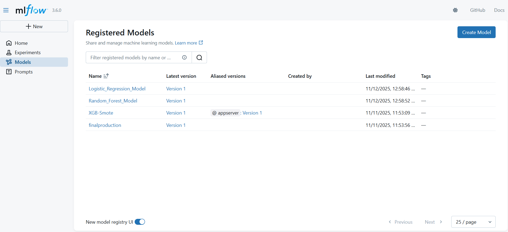

# Day 69 - MLflow Experiments — Model Training & Registration (Iris example)


This project demonstrates a **complete end-to-end MLOps workflow** in a single Python script.  
It automates the process of **training multiple models**, **tracking experiments**, and **registering models** in **MLflow Model Registry** — all without manual steps.

---

## Overview

This project showcases how MLOps principles can be implemented programmatically using **Python and MLflow**.  
When you run the script, it automatically:

- Trains **Logistic Regression** and **Random Forest** models on the **Iris dataset**
- Logs **parameters, metrics, and confusion matrix artifacts**
- Creates and updates an **MLflow experiment**
- Registers each model into the **MLflow Model Registry**
- Generates **new model versions** automatically upon re-runs

This project is intended as a clean, reproducible demo of MLflow experiment tracking and model versioning for MLOps learning / portfolio use.

---

## Key Features
* Trains two models on Iris dataset:

  * Logistic Regression
  * Random Forest
* **Fully automated ML pipeline** – no manual model registration needed  
* **Experiment tracking with MLflow** – logs metrics, parameters, and artifacts  
* **Model versioning** – new runs automatically generate new versions  
* **Visualization-ready outputs** – confusion matrices saved locally and logged  
* **Production registry structure** – ready for deployment or CI/CD integration  

---

## Contents

```
mlflow-experiments/
├── README.md
├── requirements.txt
├── mlflow_experiments.py        # Main script (recommended name)
├── mlops_using_oop.py           # Optional: object-oriented demo (your other script)
├── screenshots/                 # (optional) UI screenshots for README/docs
└── artifacts/                   # saved confusion matrix images (created during runs)
```

---

## Prerequisites

* Python 3.8+
* MLflow (local tracking server)
* (Optional) A conda/virtualenv environment for dependency isolation

---

## Install

1. Clone the repo:

```bash
git clone https://github.com/<armaan-pathan>/mlflow-experiments.git
cd mlflow-experiments
```

2. Create & activate a virtual environment (recommended):

```bash
python -m venv .venv
source .venv/bin/activate     # macOS / Linux
.venv\Scripts\activate        # Windows PowerShell
```

3. Install dependencies:

```bash
pip install -r requirements.txt
```

---

## Running MLflow UI (locally)

Start MLflow tracking UI in a terminal before running the script:

```bash
mlflow ui
```

* Default UI address: [http://127.0.0.1:5000](http://127.0.0.1:5000)
* Keep this terminal open while experiments run — it hosts the tracking server used by the script.


---

## Usage

Run the example script (recommended name `mlflow_experiments.py`):

```bash
python mlflow_experiments.py
```

What the script does:

* Creates / sets an MLflow experiment (if not present).
* Starts runs for Logistic Regression and Random Forest.
* Logs parameters, metrics and confusion matrix images as artifacts.
* Saves the trained models with `mlflow.sklearn.log_model`.
* Registers models to the MLflow Model Registry (attempts to register; if already exists it will print exception, which you can handle in code).

After the script completes, open the MLflow UI to view experiments, runs, metrics and registered model versions.
---

## Screenshots

### 1. MLflow Experiments Dashboard

Displays all created experiments such as **Iris_Classification_Experiment**, **deployment model**, and others.

It shows experiment names, creation times, and modification timestamps.


---

### 2. Experiment Runs Overview

Shows multiple runs created within the **Iris_Classification_Experiment**.

Each run logs model metrics, parameters, and duration, with direct links to the registered models.


---

### 3. Registered Models in MLflow

Lists all models registered in the MLflow Model Registry, including **Logistic_Regression_Model**, **Random_Forest_Model**, and others.

Displays their latest versions, aliases, and modification times.


---

### 4. Model Versioning in MLflow Registry

Shows detailed view of a registered model (**Logistic_Regression_Model**) with **multiple versions** created from different experiment runs.

Each version can be promoted to stages like *Staging* or *Production*.


---

## Conclusion

This project successfully demonstrates how to automate the **end-to-end MLOps workflow** using **MLflow** — from experiment tracking to model registration and versioning.

Through this implementation, models such as **Logistic Regression** and **Random Forest** were trained, evaluated, logged, and registered automatically into the MLflow Model Registry.

By integrating MLflow directly into Python scripts, the process of managing experiments and versions becomes **efficient, reproducible, and scalable** — mirroring real-world machine learning operations used in production environments.

---

## Key Learnings

* Understood the **core components of MLflow**: Experiments, Runs, Models, and Model Registry.
* Learned how to **log parameters, metrics, and artifacts** automatically during model training.
* Implemented **model registration and version control** through code, removing manual UI dependencies.
* Observed how **re-running scripts** creates **new model versions** automatically in the registry.
* Experienced the practical workflow of **tracking, comparing, and managing models** in a structured MLOps pipeline.
* Gained hands-on understanding of how **MLflow bridges the gap** between model development and deployment readiness.

---