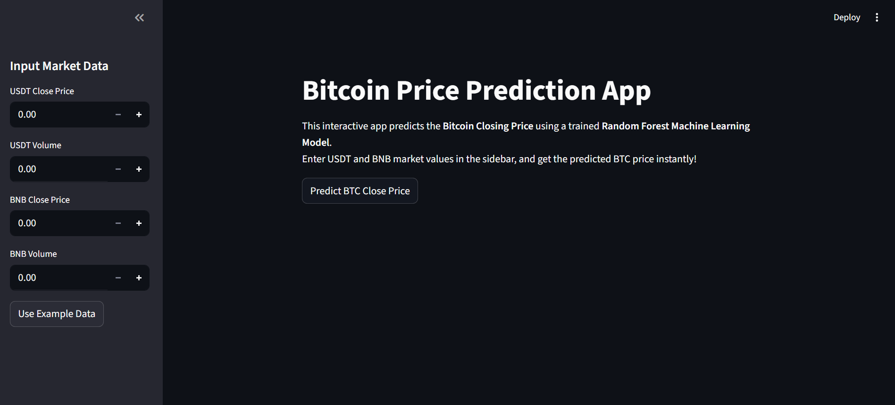
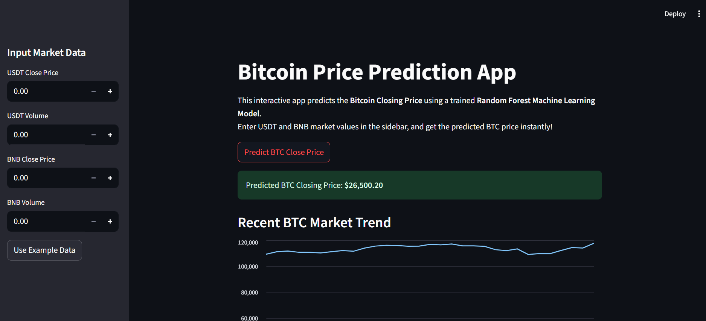
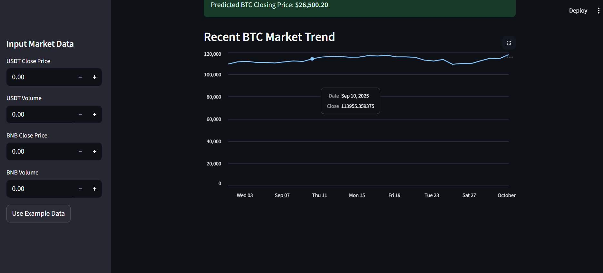

# Cryptocurrency Price Prediction with Machine Learning

This project predicts the **Bitcoin Closing Price (BTC-USD)** using **Machine Learning models** and an **interactive Streamlit web app**.  
The model leverages historical market data of **USDT** and **BNB** (closing prices & volumes) to forecast Bitcoin prices.

---

## Features
- **Data Collection**: Historical data fetched via [Yahoo Finance API](https://pypi.org/project/yfinance/).  
- **Data Preprocessing**: Feature selection, normalization, and cleaning.  
- **Machine Learning**: Trained a **Random Forest Regressor** for BTC price prediction.  
- **Evaluation Metrics**: MAE, RMSE, and R² used to assess performance.  
- **Interactive App**: Built with **Streamlit** for user-friendly predictions.  

---

## Installation & Setup

### 1️. Clone the Repository
```bash
git clone https://github.com/armaan-pathan/fsds-genai-2025.git
cd crypto-price-prediction
````

### 2️. Install Dependencies

```bash
pip install -r requirements.txt
```

### 3️. Run the Streamlit App

```bash
streamlit run app.py
```

---

## Example Input Data

Enter values in the sidebar for prediction:

```text
USDT Close Price: 1.00
USDT Volume: 160000000000
BNB Close Price: 600.00
BNB Volume: 2000000000
```

The app will output the **Predicted BTC Closing Price**.

---

## Screenshots

### Streamlit App Home



### Input Sidebar & Prediction



### BTC Market Trend Visualization



---

## Tech Stack

* **Python**
* **Pandas, NumPy, Seaborn, Matplotlib**
* **Scikit-learn**
* **yfinance**
* **Streamlit**

---

## Future Improvements

* Add more cryptocurrencies as input features.
* Compare multiple ML models (Linear Regression, XGBoost, LSTM).
* Visualize Actual vs Predicted BTC prices on the app.
* Deploy with Docker for scalable hosting.

---

## Acknowledgments

* [Yahoo Finance API](https://pypi.org/project/yfinance/) for market data
* [Streamlit](https://streamlit.io/) for the interactive frontend
* [Scikit-learn](https://scikit-learn.org/) for ML models

---

## Project Structure

```

crypto-price-prediction/
│
├── screenshots/                   # App screenshots (for README)
│
├── README.md                      # Project documentation
├── app.py                         # Streamlit app script
├── bitcoin_price_prediction.ipynb # Jupyter Notebook with model training
├── best_model.pkl                 # Saved trained Random Forest model
├── scaler.pkl                     # Saved data scaler for preprocessing
├── requirements.txt               # Python dependencies

```

